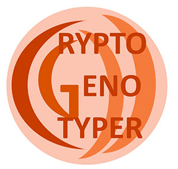

<p align="center">

</p>

[![European Galaxy server](https://img.shields.io/badge/usegalaxy-.eu-brightgreen?logo=data:image/png;base64,iVBORw0KGgoAAAANSUhEUgAAABgAAAASCAYAAABB7B6eAAAABGdBTUEAALGPC/xhBQAAACBjSFJNAAB6JgAAgIQAAPoAAACA6AAAdTAAAOpgAAA6mAAAF3CculE8AAAACXBIWXMAAAsTAAALEwEAmpwYAAACC2lUWHRYTUw6Y29tLmFkb2JlLnhtcAAAAAAAPHg6eG1wbWV0YSB4bWxuczp4PSJhZG9iZTpuczptZXRhLyIgeDp4bXB0az0iWE1QIENvcmUgNS40LjAiPgogICA8cmRmOlJERiB4bWxuczpyZGY9Imh0dHA6Ly93d3cudzMub3JnLzE5OTkvMDIvMjItcmRmLXN5bnRheC1ucyMiPgogICAgICA8cmRmOkRlc2NyaXB0aW9uIHJkZjphYm91dD0iIgogICAgICAgICAgICB4bWxuczp0aWZmPSJodHRwOi8vbnMuYWRvYmUuY29tL3RpZmYvMS4wLyI+CiAgICAgICAgIDx0aWZmOlJlc29sdXRpb25Vbml0PjI8L3RpZmY6UmVzb2x1dGlvblVuaXQ+CiAgICAgICAgIDx0aWZmOkNvbXByZXNzaW9uPjE8L3RpZmY6Q29tcHJlc3Npb24+CiAgICAgICAgIDx0aWZmOk9yaWVudGF0aW9uPjE8L3RpZmY6T3JpZW50YXRpb24+CiAgICAgICAgIDx0aWZmOlBob3RvbWV0cmljSW50ZXJwcmV0YXRpb24+MjwvdGlmZjpQaG90b21ldHJpY0ludGVycHJldGF0aW9uPgogICAgICA8L3JkZjpEZXNjcmlwdGlvbj4KICAgPC9yZGY6UkRGPgo8L3g6eG1wbWV0YT4KD0UqkwAAAn9JREFUOBGlVEuLE0EQruqZiftwDz4QYT1IYM8eFkHFw/4HYX+GB3/B4l/YP+CP8OBNTwpCwFMQXAQPKtnsg5nJZpKdni6/6kzHvAYDFtRUT71f3UwAEbkLch9ogQxcBwRKMfAnM1/CBwgrbxkgPAYqlBOy1jfovlaPsEiWPROZmqmZKKzOYCJb/AbdYLso9/9B6GppBRqCrjSYYaquZq20EUKAzVpjo1FzWRDVrNay6C/HDxT92wXrAVCH3ASqq5VqEtv1WZ13Mdwf8LFyyKECNbgHHAObWhScf4Wnj9CbQpPzWYU3UFoX3qkhlG8AY2BTQt5/EA7qaEPQsgGLWied0A8VKrHAsCC1eJ6EFoUd1v6GoPOaRAtDPViUr/wPzkIFV9AaAZGtYB568VyJfijV+ZBzlVZJ3W7XHB2RESGe4opXIGzRTdjcAupOK09RA6kzr1NTrTj7V1ugM4VgPGWEw+e39CxO6JUw5XhhKihmaDacU2GiR0Ohcc4cZ+Kq3AjlEnEeRSazLs6/9b/kh4eTC+hngE3QQD7Yyclxsrf3cpxsPXn+cFdenF9aqlBXMXaDiEyfyfawBz2RqC/O9WF1ysacOpytlUSoqNrtfbS642+4D4CS9V3xb4u8P/ACI4O810efRu6KsC0QnjHJGaq4IOGUjWTo/YDZDB3xSIxcGyNlWcTucb4T3in/3IaueNrZyX0lGOrWndstOr+w21UlVFokILjJLFhPukbVY8OmwNQ3nZgNJNmKDccusSb4UIe+gtkI+9/bSLJDjqn763f5CQ5TLApmICkqwR0QnUPKZFIUnoozWcQuRbC0Km02knj0tPYx63furGs3x/iPnz83zJDVNtdP3QAAAABJRU5ErkJggg==)](https://usegalaxy.eu/root?tool_id=CryptoGenotyper)

## CryptoGenotyper

The `CryptoGenotyper` is a fast and reproducible tool that can be used to classify the genotype of *Cryptosporidium* samples by directly analyzing the DNA electropherogram files (.ab1) that correspond to two of its characteristic gene markers: SSU rRNA and *gp60*. 

*Cryptosporidium* is a protozoan parasite that causes the enteric disease, cryptosporidiosis. It is transmitted to both humans and animals through zoonotic or anthroponotic means, and these dynamics can be studied through the analysis of SSU rRNA or *gp60* gene locus. Although due to the nature of these gene targets, manual analysis can be repetitive and difficult, allowing for the potential of inaccurate or incomplete results to be reported. 

CryptoGenotyper is able to analyze both well-defined and poorly-resolved peaks to ultimately output the corresponding sequence along with the *Cryptosporidium* genotype in standard nomenclature.

## Requirements
* `biopython >= 1.70,<1.78`
* `numpy >= 1.1`
* `python > 3.6`
* `blast == 2.9.0`
* `clustalw >= 2.1`

If running Ubuntu these requirements could be installed via one-liner command (might need preceed with `sudo`). Due to version restriction, biopython is installed via `pip3`

```
apt install clustalw ncbi-blast+ python3 python3-numpy python3-pip && pip3 install "biopython>=>=1.7,<1.78"
```

## Installation
The `CryptoGenotyper` can be installed by pulling source code from this repository or via `conda` package management system from the `bioconcda` channel.

* `git clone https://github.com/phac-nml/CryptoGenotyper.git && cd CryptoGenotyper && python3 setup.py install`
* `conda install -c bioconda cryptogenotyper`

## Usage
Only few parameters required to run `cryptogenotyper` including input `*.ab1` file, marker (`18S` or `gp60`), sequence type (`forward`, `reverse`, `contig`), output prefix. 


```
usage: cryptogenotyper [-h] [--verbose] -i INPUT -m MARKER -t SEQTYPE
                       [-f FORWARDPRIMERNAME] [-r REVERSEPRIMERNAME]
                       [-o OUTPUTPREFIX] [-d DATABASEFILE] [-v]
                       [--noheaderline]

In silico type cryptosporidium from sanger reads in AB1 format

optional arguments:
  -h, --help            show this help message and exit
  --verbose             Turn on verbose logging [False].
  -i INPUT, --input INPUT
                        Path to directory with AB1 forward and reverse files
                        OR path to a single AB1 file
  -m MARKER, --marker MARKER
                        Name of the marker. Currently gp60 and 18S markers are
                        supported
  -t SEQTYPE, --seqtype SEQTYPE
                        Input sequences type. Select one option out of these
                        three: contig - both F and R sequences provided
                        forward - forward only sequence provided reverse -
                        reverse only sequence provided
  -f FORWARDPRIMERNAME, --forwardprimername FORWARDPRIMERNAME
                        Name of the forward primer to identify forward read
                        (e.g. gp60F, SSUF)
  -r REVERSEPRIMERNAME, --reverseprimername REVERSEPRIMERNAME
                        Name of the reverse primer to identify forward read
                        (e.g. gp60R, SSUR)
  -o OUTPUTPREFIX, --outputprefix OUTPUTPREFIX
                        Output name prefix for the results (e.g. test results
                        in test_report.fa)
  -d DATABASEFILE, --databasefile DATABASEFILE
                        Custom database reference file
  -v, --version         show program's version number and exit
  --noheaderline        Display header on tab-delimited file [False]
```

## Examples
The `example` folder contains a couple of sequences to try out by executing the following commands.

```
cryptogenotyper -i example/P17705_Crypto16-2F-20170927_SSUF_G12_084.ab1 -m 18S -t forward -f SSUF -o test
cryptogenotyper -i example/P17705_gp60-Crypt14-1F-20170927_gp60F_G07_051.ab1 -m gp60 -t forward -f gp60F -o test
cryptogenotyper -i example/ -m 18S -t contig -f SSUF -r SSUR -o test
cryptogenotyper -i example/ -m gp60 -t contig -f gp60F -r gp60R -o test

```

## Citation
Please cite the following publication if you find this subtyping tool useful in your work.


Yanta, C.A., Bessonov, K., Robinson, G., Troell, K., Guy, R.A. (2021) CryptoGenotyper: A new bioinformatics tool for rapid _Cryptosporidium_ identification. _Food and Waterborne Parasitology_, 23:e00115. doi: [10.1016/j.fawpar.2021.e00115](https://doi.org/10.1016/j.fawpar.2021.e00115)

